<p align="center">
  
</p>

<p align="center">
  <strong>Data Science Student Building AI Tools, Dashboards, and Digital Platforms</strong>
</p>

<p align="center">
  <a href="https://davishiggins.com">Digital Hub</a>
  &nbsp;|&nbsp;
  <a href="https://davishiggins.com/#portfolio">Portfolio</a>
  &nbsp;|&nbsp;
  <a href="https://propifyai.davishiggins.com">Propify</a>
  &nbsp;|&nbsp;
  <a href="https://notes.davishiggins.com">Curated Notes</a>
  &nbsp;|&nbsp;
  <a href="mailto:davishiggins@icloud.com">Email</a>
</p>

<p align="center">
  
</p>

<p align="center">
  
  
  
  
</p>

<p align="center">
  
</p>

<p align="center">
  
</p>


## System Status

```bash
> whoami
Davis Higgins

> operating_mode
Data Science x AI x Web Systems

> current_mission
Build useful systems, ship polished products, and turn data into better decisions.
```

<!-- CURRENT_FOCUS:START -->
### Currently Building

<table>

<tr>
  <td width="28%" valign="top"><a href="https://higginsd.com"><strong>Higgins Digital</strong></a></td>
  <td width="72%" valign="top">Scaling a premium website studio for real businesses</td>
</tr>

<tr>
  <td width="28%" valign="top"><a href="https://propifyai.davishiggins.com"><strong>Propify</strong></a></td>
  <td width="72%" valign="top">Building an AI sports analytics and projection platform</td>
</tr>

<tr>
  <td width="28%" valign="top"><a href="https://davishiggins.com"><strong>DavisHiggins.com</strong></a></td>
  <td width="72%" valign="top">Designing a personal interactive portfolio and builder OS</td>
</tr>

<tr>
  <td width="28%" valign="top"><a href="https://crowncode.higginsd.com"><strong>CrownCodeAI</strong></a></td>
  <td width="72%" valign="top">Creating Claude-powered website generation workflows</td>
</tr>
</table>
<!-- CURRENT_FOCUS:END -->


<!-- FEATURED_PROJECTS:START -->
## Featured Systems

<table>

<tr>
  <td valign="top">
    <strong>Propify</strong><br/>
    <sub>AI sports analytics platform with projection logic, clean UX, and data-driven betting research tools.</sub><br/><br/>
    <code>Next.js</code> &middot; <code>Python</code> &middot; <code>ML</code> &middot; <code>Sports Data</code>
    <br/><br/>
    <a href="https://propifyai.davishiggins.com">Live</a>
  </td>
</tr>

<tr>
  <td valign="top">
    <strong>Higgins Digital</strong><br/>
    <sub>Website studio for premium redesigns, client acquisition systems, and high-converting business sites.</sub><br/><br/>
    <code>Next.js</code> &middot; <code>Vercel</code> &middot; <code>UI/UX</code> &middot; <code>Automation</code>
    <br/><br/>
    <a href="https://higginsd.com">Live</a>
  </td>
</tr>

<tr>
  <td valign="top">
    <strong>DavisHiggins.com</strong><br/>
    <sub>Personal site rebuilt as an interactive portfolio with motion design, tabs, and project storytelling.</sub><br/><br/>
    <code>Next.js</code> &middot; <code>GSAP</code> &middot; <code>Framer Motion</code> &middot; <code>Three.js</code>
    <br/><br/>
    <a href="https://davishiggins.com">Live</a>
  </td>
</tr>

<tr>
  <td valign="top">
    <strong>CrownCodeAI</strong><br/>
    <sub>AI-assisted website generation system built around Claude workflows, brand kits, and implementation files.</sub><br/><br/>
    <code>Claude</code> &middot; <code>Next.js</code> &middot; <code>Prompt Systems</code> &middot; <code>Productization</code>
    <br/><br/>
    <a href="https://crowncode.higginsd.com">Live</a>
  </td>
</tr>
</table>
<!-- FEATURED_PROJECTS:END -->

## Build Stack

<table>
  <tr>
    <td><strong>Frontend</strong></td>
    <td>Next.js &middot; React &middot; TypeScript &middot; Tailwind &middot; GSAP &middot; Framer Motion &middot; Three.js</td>
  </tr>
  <tr>
    <td><strong>Data</strong></td>
    <td>Python &middot; SQL &middot; pandas &middot; scikit-learn &middot; Power BI &middot; Tableau &middot; Excel</td>
  </tr>
  <tr>
    <td><strong>AI / Automation</strong></td>
    <td>Claude Code &middot; Codex &middot; OpenAI workflows &middot; Supabase &middot; local command systems</td>
  </tr>
  <tr>
    <td><strong>Business Systems</strong></td>
    <td>Lead generation &middot; client sites &middot; analytics dashboards &middot; project operating systems</td>
  </tr>
</table>

## Operating Principles

- Build things that are actually useful.
- Make the interface feel premium, not bloated.
- Turn scattered ideas into shipped systems.
- Use data, automation, and design to create leverage.


<!-- SHIP_LOG:START -->
## Recent Ship Log

<table>

<tr>
  <td width="18%" valign="top"><code>2026-06</code></td>
  <td width="82%" valign="top">
    <strong>Higgins Building Group rebuild system</strong><br/>
    <sub>Built implementation direction for a higher-quality hero montage, gallery upgrades, and client-ready site polish.</sub>
  </td>
</tr>

<tr>
  <td width="18%" valign="top"><code>2026-06</code></td>
  <td width="82%" valign="top">
    <strong>Claude Code command center plan</strong><br/>
    <sub>Designed a system for tracking projects, unfinished tasks, build history, and next actions across local work.</sub>
  </td>
</tr>

<tr>
  <td width="18%" valign="top"><code>2026-06</code></td>
  <td width="82%" valign="top">
    <strong>DavisHiggins.com visual rebuild</strong><br/>
    <sub>Planned individual tab experiences, portfolio sections, 21st.dev components, and Luke Baffait-inspired motion.</sub>
  </td>
</tr>

<tr>
  <td width="18%" valign="top"><code>2026-06</code></td>
  <td width="82%" valign="top">
    <strong>Higgins Digital content engine</strong><br/>
    <sub>Created brand positioning, carousel post strategy, website transformation stories, and service framing.</sub>
  </td>
</tr>
</table>
<!-- SHIP_LOG:END -->

## GitHub Command Center

<p align="center">
  
</p>


## Connect

<p align="center">
  <a href="https://davishiggins.com"></a>
  <a href="https://higginsd.com"></a>
  <a href="mailto:dhiggi15@charlotte.edu"></a>
</p>
