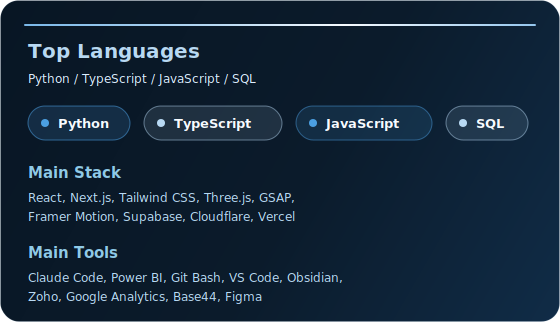

  

  <strong>Data Science Student Building AI Tools, Dashboards, and Digital Platforms</strong>

  <a href="https://davishiggins.com">Digital Hub</a>
  &nbsp;|&nbsp;
  <a href="https://davishiggins.com/#portfolio">Portfolio</a>
  &nbsp;|&nbsp;
  <a href="https://notes.davishiggins.com">Curated Notes</a>
  &nbsp;|&nbsp;
  <a href="mailto:davishiggins@icloud.com">Email</a>

  

  
  
  
  

  

