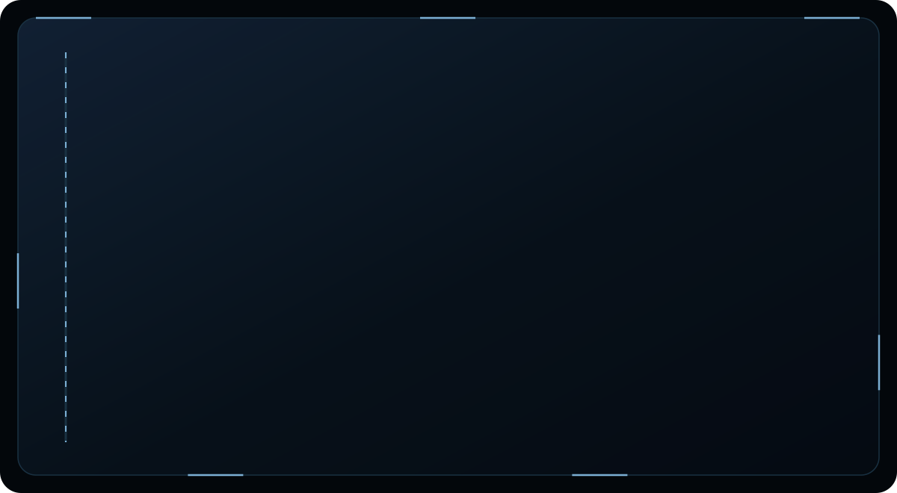

  

  
  
  
  
  

 

## 01 — About

I'm a senior at UNC Charlotte studying Data Science with a minor in Artificial
Intelligence, and I spend most of my time turning messy problems into systems
people can actually use.

That work splits three ways. At **Kewaunee Scientific** I build the business
intelligence layer — Power BI and Zoho Analytics dashboards, KPI reporting, and
the data governance that keeps all of it trustworthy. Through **Higgins Digital**,
the studio I founded, I design and ship high-performance websites for real
businesses. And on my own time I build tools: agentic systems, sports analytics
models, and AI workflows that remove the boring parts of a day.

The common thread is that I don't think of data, design, and engineering as
separate disciplines. A dashboard nobody reads is a design failure. A beautiful
site that loads slowly is an engineering failure. I'd rather own the whole line
from raw data to the thing a person finally looks at.

 

## 02 — System Map

Everything I build hangs off one identity. `davishiggins.com` is the hub, and
each surface below it exists for a specific audience — a client, a reader, a
recruiter, a chapter of ninety guys — rather than being another copy of the same
portfolio. The map below is the current shape of that system.

 

## 03 — Projects

Ten products, all live or actively being built. A few are commercial, a few are
experiments that earned their keep, and one is the operating system I use to run
my own week.

  
  

  
  

  
  

  
  

  
  

  
<strong>Accessible project directory</strong>

   

  | Project | Surface | Purpose |
  |---|---|---|
  | [Cade](https://cade.davishiggins.com) | Agentic system | Personal agentic operating system with persistent, structured memory |
  | [Higgins Digital](https://higginsd.com) | Web studio | High-performance websites and digital branding for real businesses |
  | [Propify](https://propifyai.davishiggins.com) | Sports analytics | Sports analytics and projection platform |
  | [CrownCodeAI](https://crowncode.higginsd.com) | AI tool | AI-powered website generation concept and tool |
  | [Davis Higgins Portfolio](https://portfolio.davishiggins.com) | Personal platform | Interactive portfolio and project hub |
  | [Phi Delta Theta Chaplain Platform](https://chaplain.davishiggins.com) | Community tool | Chapter leadership and spiritual growth platform |
  | [Photos & Frames](https://photos.davishiggins.com) | Photography | Photography, gallery, and digital archive |
  | [Curated Notes](https://notes.davishiggins.com) | Writing | Editorial platform for original articles and notes |
  | [davishiggins.com V2](https://v2.davishiggins.com) | Personal platform | Full personal site and portfolio rebuild |
  | [AI Workflow OS](https://ai.davishiggins.com) | AI education | Practical courses and guides for people new to AI |

 

## 04 — Statistics Overview

Measured output across analytics, web work, and school. The dashboard count is
production work at Kewaunee; the website count spans personal and client builds
through Higgins Digital.

A rolling twelve-month view of my public commit history, regenerated daily —
**currently showing August 2025 through July 2026.**

<picture>
  <source media="(prefers-color-scheme: dark)" srcset="https://raw.githubusercontent.com/DavisHiggins/DavisHiggins/output/github-contribution-grid-snake-dark.svg" />
  <source media="(prefers-color-scheme: light)" srcset="https://raw.githubusercontent.com/DavisHiggins/DavisHiggins/output/github-contribution-grid-snake.svg" />
  
</picture>

 

## 05 — Current Positions

Four roles, all active — one in industry analytics, two I founded, and one in
chapter leadership.

 

## 06 — Stack

Python and SQL for the analysis, Next.js and TypeScript for the interfaces,
and Claude Code threaded through most of how I actually work day to day.

 

  Designed and built by <a href="https://davishiggins.com">Davis Higgins</a> · Charlotte, North Carolina

