# TASK: Fix + Polish Davis Higgins GitHub Profile README System

## Repository

`DavisHiggins/DavisHiggins`

## Primary Goal

Fix every current GitHub profile issue and make the GitHub profile look cleaner, smoother, more impressive, and more professional.

This task must:

1. Fix broken GitHub Actions workflow placement.
2. Fix the contribution snake animation.
3. Fix README spacing and overflow issues.
4. Improve the GitHub stats, top languages, streak, and contribution sections.
5. Make dynamic sections render cleaner.
6. Tighten vertical spacing.
7. Implement the uploaded `DH` logo into the headline/header.
8. Keep the profile premium, clean, compact, and aligned with Davis Higgins / Higgins Digital branding.

Do **not** build a website app.  
Do **not** change unrelated files.  
Do **not** remove the existing profile system unless replacing it with a cleaner version.

---

## Asset Requirement

The uploaded DH logo image must be added to the repo as:

```txt
assets/dh-logo.png
```

Use the uploaded logo file as the source image.

Do not stretch, crop, blur, or distort the logo. It should appear cleanly above the profile hero/headline in the README.

---

# Phase 1: Move GitHub Actions Workflows

GitHub only detects workflows inside:

```txt
.github/workflows/
```

Current issue: the workflows are currently in the wrong root-level `workflows/` folder.

## Required actions

Create this folder:

```txt
.github/workflows/
```

Move:

```txt
workflows/generate-snake.yml
```

to:

```txt
.github/workflows/generate-snake.yml
```

Move:

```txt
workflows/update-profile.yml
```

to:

```txt
.github/workflows/update-profile.yml
```

Then delete the old root folder:

```txt
workflows/
```

There should be no root-level `workflows/` folder when finished.

---

# Phase 2: Add the DH Logo Asset

Add the uploaded DH logo image to:

```txt
assets/dh-logo.png
```

Make sure the file is committed and accessible from README using:

```html

```

The logo should visually act as the profile mark above the hero/headline.

---

# Phase 3: Replace the Top Header in `README.md`

Replace the current top intro/header area with this tighter branded header:

```md
<p align="center">
  
</p>

<p align="center">
  
</p>

<p align="center">
  <strong>Building sharper systems for smarter decisions.</strong>
</p>

<p align="center">
  <a href="https://davishiggins.com">Portfolio</a>
  ·
  <a href="https://higginsd.com">Higgins Digital</a>
  ·
  <a href="https://propifyai.davishiggins.com">Propify</a>
  ·
  <a href="mailto:dhiggi15@charlotte.edu">Email</a>
</p>

<p align="center">
  
  
  
  
</p>

<p align="center">
  
</p>
```

Important:
- Keep the existing hero banner.
- Keep the existing terminal card.
- Keep the top links.
- Make the DH logo appear above the hero.
- Do not overcrowd the top of the README.

---

# Phase 4: Replace `scripts/update-profile.js`

Replace the entire file with this version.

This fixes wide Markdown table overflow by rendering cleaner GitHub-safe HTML sections.

```js
const fs = require("fs");
const path = require("path");

const root = path.resolve(__dirname, "..");
const readmePath = path.join(root, "README.md");

function readJson(relativePath) {
  return JSON.parse(fs.readFileSync(path.join(root, relativePath), "utf8"));
}

function escapeRegex(value) {
  return value.replace(/[.*+?^${}()|[\]\\]/g, "\\$&");
}

function escapeHtml(value = "") {
  return String(value)
    .replaceAll("&", "&amp;")
    .replaceAll("<", "&lt;")
    .replaceAll(">", "&gt;")
    .replaceAll('"', "&quot;")
    .replaceAll("'", "&#039;");
}

function replaceBlock(content, markerName, nextBlock) {
  const start = `<!-- ${markerName}:START -->`;
  const end = `<!-- ${markerName}:END -->`;
  const regex = new RegExp(`${escapeRegex(start)}[\\s\\S]*?${escapeRegex(end)}`);

  if (!regex.test(content)) {
    throw new Error(`Missing README block markers for ${markerName}`);
  }

  return content.replace(regex, `${start}\n${nextBlock.trim()}\n${end}`);
}

function renderStack(stack = []) {
  return stack.map((item) => `<code>${escapeHtml(item)}</code>`).join(" · ");
}

function renderCurrentFocus() {
  const focus = readJson("data/current-focus.json");

  const rows = focus
    .map((item) => {
      const name = escapeHtml(item.name);
      const status = escapeHtml(item.status);
      const link = item.link
        ? `<a href="${escapeHtml(item.link)}"><strong>${name}</strong></a>`
        : `<strong>${name}</strong>`;

      return `
<tr>
  <td width="28%" valign="top">${link}</td>
  <td width="72%" valign="top">${status}</td>
</tr>`;
    })
    .join("\n");

  return `
### Currently Building

<table>
${rows}
</table>`;
}

function renderProjects() {
  const projects = readJson("data/projects.json");

  const rows = projects
    .map((project) => {
      const name = escapeHtml(project.name);
      const description = escapeHtml(project.description);
      const live = project.live
        ? `<a href="${escapeHtml(project.live)}">Live</a>`
        : "";
      const repo = project.repo
        ? `<a href="${escapeHtml(project.repo)}">Repo</a>`
        : "";
      const links = [live, repo].filter(Boolean).join(" · ") || "Private";

      return `
<tr>
  <td valign="top">
    <strong>${name}</strong><br/>
    <sub>${description}</sub><br/><br/>
    ${renderStack(project.stack)}
    <br/><br/>
    ${links}
  </td>
</tr>`;
    })
    .join("\n");

  return `
## Featured Systems

<table>
${rows}
</table>`;
}

function renderShipLog() {
  const logs = readJson("data/ship-log.json");

  const rows = logs
    .map((item) => {
      return `
<tr>
  <td width="18%" valign="top"><code>${escapeHtml(item.date)}</code></td>
  <td width="82%" valign="top">
    <strong>${escapeHtml(item.title)}</strong><br/>
    <sub>${escapeHtml(item.detail)}</sub>
  </td>
</tr>`;
    })
    .join("\n");

  return `
## Recent Ship Log

<table>
${rows}
</table>`;
}

function main() {
  let readme = fs.readFileSync(readmePath, "utf8");

  readme = replaceBlock(readme, "CURRENT_FOCUS", renderCurrentFocus());
  readme = replaceBlock(readme, "FEATURED_PROJECTS", renderProjects());
  readme = replaceBlock(readme, "SHIP_LOG", renderShipLog());

  fs.writeFileSync(readmePath, readme);
  console.log("Profile README updated from data files.");
}

main();
```

---

# Phase 5: Replace GitHub Activity Section in `README.md`

In `README.md`, replace the current GitHub stats/top languages/contribution section with this:

```md
## GitHub Command Center

<table>
  <tr>
    <td width="50%" valign="top">
      
    </td>
    <td width="50%" valign="top">
      
    </td>
  </tr>
</table>

<p align="center">
  
</p>

## Contribution Trail

<p align="center">
  <picture>
    <source media="(prefers-color-scheme: dark)" srcset="https://raw.githubusercontent.com/DavisHiggins/DavisHiggins/output/github-contribution-grid-snake-dark.svg" />
    <source media="(prefers-color-scheme: light)" srcset="https://raw.githubusercontent.com/DavisHiggins/DavisHiggins/output/github-contribution-grid-snake.svg" />
    
  </picture>
</p>
```

This should make the stats section look more premium, balanced, and branded.

---

# Phase 6: Replace `assets/section-divider.svg`

Replace the whole file with this shorter version to reduce vertical whitespace:

```svg
<svg width="1200" height="42" viewBox="0 0 1200 42" fill="none" xmlns="http://www.w3.org/2000/svg" role="img" aria-label="Animated section divider">
  <defs>
    <linearGradient id="g" x1="0" y1="0" x2="1200" y2="0" gradientUnits="userSpaceOnUse">
      <stop offset="0" stop-color="#4B9FE1" stop-opacity="0"/>
      <stop offset="0.2" stop-color="#4B9FE1" stop-opacity="0.45"/>
      <stop offset="0.5" stop-color="#F7FBFF" stop-opacity="0.9"/>
      <stop offset="0.8" stop-color="#4B9FE1" stop-opacity="0.45"/>
      <stop offset="1" stop-color="#4B9FE1" stop-opacity="0"/>
      <animateTransform attributeName="gradientTransform" type="translate" from="-1200 0" to="1200 0" dur="5.5s" repeatCount="indefinite"/>
    </linearGradient>
  </defs>

  <rect y="20" width="1200" height="2" rx="1" fill="url(#g)"/>
  <circle cx="600" cy="21" r="5" fill="#B8D9F3">
    <animate attributeName="r" values="4;7;4" dur="2.4s" repeatCount="indefinite"/>
    <animate attributeName="opacity" values=".4;.9;.4" dur="2.4s" repeatCount="indefinite"/>
  </circle>
</svg>
```

---

# Phase 7: Replace `.github/workflows/generate-snake.yml`

Use this full file:

```yaml
name: Generate Contribution Snake

on:
  workflow_dispatch:
  schedule:
    - cron: "27 12 * * *"

permissions:
  contents: write

concurrency:
  group: contribution-snake
  cancel-in-progress: true

jobs:
  generate:
    runs-on: ubuntu-latest
    timeout-minutes: 10

    steps:
      - name: Checkout profile repo
        uses: actions/checkout@v4
        with:
          fetch-depth: 0

      - name: Generate snake SVGs
        uses: Platane/snk@v3
        with:
          github_user_name: DavisHiggins
          outputs: |
            dist/github-contribution-grid-snake.svg?color_snake=#4B9FE1&color_dots=#EBEDF0,#B8D9F3,#7FB8E8,#4B9FE1,#1F6FAE
            dist/github-contribution-grid-snake-dark.svg?palette=github-dark&color_snake=#B8D9F3

      - name: Publish snake SVGs to output branch
        run: |
          git config user.name "github-actions[bot]"
          git config user.email "41898282+github-actions[bot]@users.noreply.github.com"

          git checkout --orphan output
          git rm -rf . || true

          cp -R dist/. .
          touch .nojekyll

          git add .
          git commit -m "Generate contribution snake" || exit 0
          git push -f origin output
```

---

# Phase 8: Replace `.github/workflows/update-profile.yml`

Use this full file:

```yaml
name: Update Profile README

on:
  workflow_dispatch:
  schedule:
    - cron: "12 12 * * *"
  push:
    paths:
      - "data/**"
      - "scripts/**"
      - "README.md"
      - ".github/workflows/update-profile.yml"

permissions:
  contents: write

concurrency:
  group: update-profile-readme
  cancel-in-progress: true

jobs:
  update-readme:
    runs-on: ubuntu-latest
    timeout-minutes: 10

    steps:
      - name: Checkout repository
        uses: actions/checkout@v4

      - name: Set up Node
        uses: actions/setup-node@v4
        with:
          node-version: "20"

      - name: Regenerate dynamic README sections
        run: npm run update

      - name: Commit updated README if changed
        run: |
          if git diff --quiet README.md; then
            echo "README.md is already up to date."
            exit 0
          fi

          git config user.name "github-actions[bot]"
          git config user.email "41898282+github-actions[bot]@users.noreply.github.com"
          git add README.md
          git commit -m "Update profile README"
          git push
```

---

# Phase 9: Run Update Script

After making the file changes, run:

```bash
npm run update
```

Confirm the README dynamic sections regenerated correctly.

Expected sections:

```txt
Currently Building
Featured Systems
Recent Ship Log
```

They should no longer render as wide Markdown tables.

---

# Phase 10: Commit Changes

Run:

```bash
git add .
git commit -m "Polish GitHub profile layout and workflow system"
git push origin main
```

---

# Phase 11: Manually Run GitHub Actions

After pushing, go to:

```txt
GitHub repo → Actions
```

Manually run:

```txt
Generate Contribution Snake
```

Then manually run:

```txt
Update Profile README
```

After `Generate Contribution Snake` finishes, confirm a branch exists called:

```txt
output
```

Confirm it contains:

```txt
github-contribution-grid-snake.svg
github-contribution-grid-snake-dark.svg
.nojekyll
```

---

# Phase 12: Final QA Checklist

Check the live profile at:

```txt
https://github.com/DavisHiggins
```

Confirm:

```txt
[ ] DH logo appears above the profile hero
[ ] Hero banner still loads correctly
[ ] Terminal card is not too wide or awkward
[ ] Currently Building section does not overflow
[ ] Featured Systems section does not overflow
[ ] Recent Ship Log section does not overflow
[ ] GitHub stats card loads
[ ] Top languages card loads
[ ] Streak stats card loads
[ ] Contribution snake loads
[ ] Section dividers are tighter and cleaner
[ ] No broken image icons
[ ] No root-level workflows folder remains
[ ] Workflows are inside .github/workflows
```

---

# Important Notes

Keep the profile clean and premium.

Do not overcomplicate the README with too many badges, animations, or random widgets.

The profile should communicate:

```txt
Davis Higgins
Data Science
AI Systems
Premium Web Builds
Analytics
Higgins Digital
Propify
Clean execution
```

Final result should feel smoother, more impressive, more branded, and more intentional.
